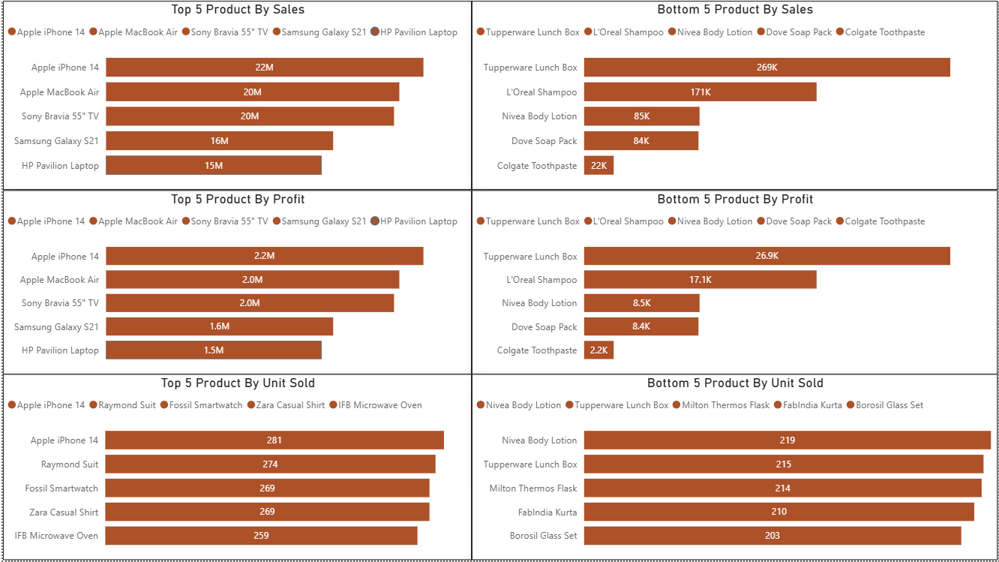
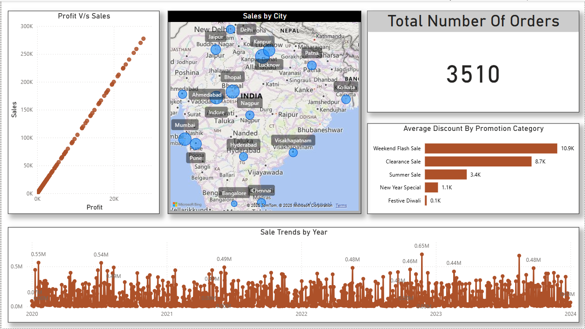
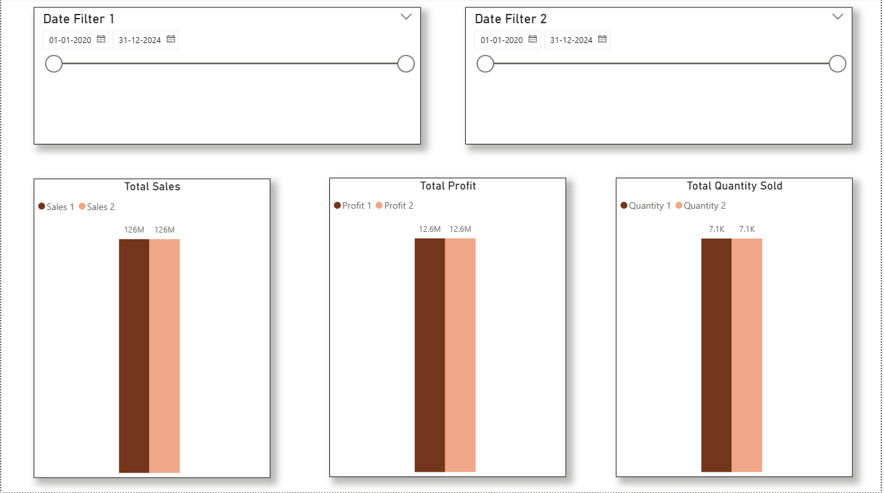

# 📊 Power BI Project – Sales Data Analysis

An interactive Power BI dashboard built to analyze sales performance, monitor KPIs, and generate actionable business insights.  
This project uses raw sales data in Excel and applies data cleaning, transformation, and visualization techniques in Power BI.

---

## 🔗 Table of Contents
- [📘 Project Overview](#-project-overview)
- [📁 Folder Structure](#-folder-structure)
- [📦 Dataset Description](#-dataset-description)
- [📋 Project Requirements](#-project-requirements)
- [📊 Dashboard Features](#-dashboard-features)
- [🛠️ Tools Used](#️-tools-used)
- [✍️ Author](#-author)

---

## 📘 Project Overview
The **Sales Data Analysis Dashboard** is designed to help businesses track sales trends, compare performance across regions, and monitor key performance indicators (KPIs).  
The project covers the complete process from importing and cleaning raw data to designing an interactive Power BI dashboard.

---

## 📁 Folder Structure

powerbi-sales-analysis/
│
├── 01_Data/
│ └── Store Data.xlsx
│
├── 02_PowerBI_Dashboard/
│ └── Power BI Project - Sales Data Analysis.pbix
│
├── 03_Requirement/
│ └── Requirements.pptx
│
├── 04_Images/
│ ├── 1.png
│ ├── 2.png
│ ├── 3.png
│ └── 4.png
│
└── README.md

---

## 📦 Dataset Description
The dataset (**Store Data.xlsx**) contains:
- **Order Details** – Order ID, Date, Quantity, Sales, Profit
- **Customer Info** – Customer ID, Name, Segment
- **Product Details** – Product ID, Category, Sub-category
- **Geography** – Region, State, Country

---

## 📋 Project Requirements
(From the [Project Requirements PPT](./03_Requirement/Requirements.pptx))

1. **Overall Performance** – Total sales, profit, and quantity sold  
2. **Regional Analysis** – Sales and profit by region/state  
3. **Category Analysis** – Product category/sub-category performance  
4. **Time Trends** – Monthly and yearly sales trends  
5. **Top Performers** – Top 5 products and customers by sales  
6. **Filters** – Interactive slicers for category, region, and date

---

## 📊 Dashboard Features
📂 [View PBIX File](./02_PowerBI_Dashboard/Power%20BI%20Project%20-%20Sales%20Data%20Analysis.pbix)  

- Interactive filters and slicers for dynamic analysis  
- KPI cards showing total sales, profit, and quantity  
- Line charts for monthly trends  
- Bar charts for category and region comparison  
- Table visual for top-performing products/customers  

---

## 📸 Dashboard Images
  
  
  
  

---

## 🛠️ Tools Used
- **Power BI** – Data visualization & dashboard creation  
- **Excel** – Raw data storage and initial data cleaning  
- **DAX** – Calculated columns & measures for KPIs  
- **Power Query** – Data transformation  

---

## ✍️ Author
**Gulbaaz**  
DTU’22 | Aspiring Data & Business Analyst | SQL, Excel, Power BI Projects on GitHub  
📫 [GitHub Profile](https://github.com/Gulbaaz)

